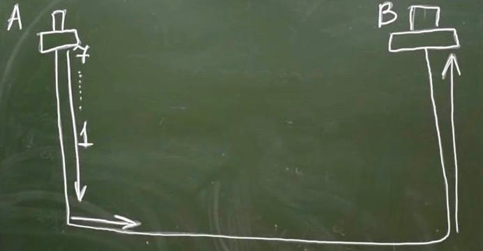

# Сетевая модель OSI (Open System Interconnection)

## 7 уровней:

1. Физический - никакой группировки данных, только "нолики и единички".

2. Канальный - описываем протоколы, чтобы разобрать 0 и 1. 
  * Блоки данных L2 PDU (Layer 2 Protocol Data Unit)
  * Frame (Кадр)
  * Вводится адресация: MAC (Media Access Control) адреса
  * Работает Ethernet

3. Сетевой - вводится глобальная адресация. 
  * IPv4 - протокол 
  * IPv6
  * Блок данных - Пакет

4. Транспортный - обратиться к конкретному приложению. 
  * TCP/UDP/ICMP - протоколы

5. Уровень сеансов - управление сеансами данных.
  * Запоминают, что уже было передано, продолжают передачу с того момента

6. Уровень представлений
  * Разные форматы, преобразование между ними

7. Уровень приложений (прикладные протоколы)
  * HTTP(S)/FTP/POP3/DNS

## Поговорим об устройствах: 

1. Концентраторы (Hub)
  * Усилители (очищают от шума, восстанавливают)

2. Коммутатор (Switch)

3. Маршрутизатор (Router) - взаимодействует с пакетами

4. FireWall - фильтрует трафик

## Откуда появилась такая идея?

Почему нельзя объединить? - Хотим получить гибкость. Есть возможность выбирать протоколы на каждом уровне.

## Передача данных:

Данные передаются последовательно от самого верхнего к самому нижнему уровню. 
Принимаются наоборот. 

Инкапсуляция: помещение данных более высокого уровня в структуры более нижних уровней.

Такой идеальной ситуации не бывает. Между ними есть другие устройства. Может стоять устройство для усиления сигнала (Физический Уровень):

Могут быть устройства более высоких уровней:

Чаще всего расположено несколько таких устройств:

## Топологии (Физические):

* Bus
* Star
* Full mesh
* Partial mesh
* Ring

Ethernet не работает с кольцами.