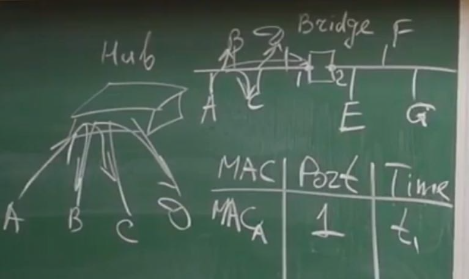

# Канальный уровень (2-ой уровень): Ethernet

Первый Ethernet работал на топологии Шина. Если кто-то отсылает - получают все.

## Структура кадра Ethernet:

Состоит из трех частей: Заголовок, Полезная нагрузка и Концевик (контрольная сумма).

| SFD (зарезервированный кусок) | Header | Data | FCS | SFD |
|-------------------------------|--------|------|-----|-----|
| | DA (6 байт) SA (6 байт) T\L (2 байта)  | Переменной длины | 4 байта

Все что между двумя SFD и есть ```Frame```.

Описание полей:

* SFD (Start Frame Delimiter): Специальная последовательность байтов, обозначающая начало кадра.
* Header: Заголовок кадра, содержащий информацию о получателе, отправителе и типе данных.
  * DA (Destination Address): MAC-адрес получателя.
  * SA (Source Address): MAC-адрес отправителя.
  * T/L (Type/Length): Поле, которое указывает, является ли следующий фрагмент данных типом (тип протокола верхнего уровня) или длиной (количество байт данных).
* Data: Данные, которые передаются.
* FCS (Frame Check Sequence): Проверочная сумма, используемая для обнаружения ошибок при передаче кадра.

Кадр ограничен в ```1500 байт``` (чтобы не занималась надолго линия).

Есть ограничение и на минимальный размер кадра ```64 байта```. Так как может получиться, что мы не сможем определить коллизию (чтобы не возникало таких ситуации). Чтобы хватило времени сигналу пройти от одной точки до другой удаленной точки.

### MAC Адреса

**MAC** (Media Access Control) адрес состоит из двух частей по 3 байта:
 
| Идентификатор производителя OUI (Organizationally Unique Identifier) - 3 байта | Уникальное число в серии продукта - 3 байта | 
|-|-|

За уникальным числом следит производитель. 

Если не хватает числа из серии продукта - выделяется еще одни идентификатор под данное устройство.

Пример MAC-адреса (Записывается в 16-ти речной записи):

* 00:16:3E:00:00:00
   * 00:16:3E: Это OUI (идентификатор производителя) для Cisco Systems, Inc.
   * 00:00:00: Это уникальное число в серии продукта, которое присваивается конкретному устройству.

Есть три типа записи MAC-Адреса:
* 00:11:22:33:44:ab
* 00-11-22-33-44-ab
* В CISCO Systems свой формат (через точку по 4): 0011.2233.44ab

Есть зарезервированные адреса. Широковещательные MAC-адреса (BroadCast) используются для передачи сообщений всем устройствам в сети. 

MAC-адрес широковещательной рассылки:
* FF:FF:FF:FF:FF:FF 

#### DA

Если адреса не совпадают - Frame отбрасывается.

### T/L - тип или длина

Существует несколько разных форматов ```Ethernet frame```. Что это за данные, какой протокол ```сетевого уровня``` отдал эти данные. 

По самому значению поля можно понять тип это или длина. Если значение маленькое (< 1536) - то тип.

### Data

В стандарте 100 Base-Tx - используется кодирование 4B/5B (4 байта превращаем в 5 байт). Хотим получить зарезервированные поля.

#### Вернемся к топологии Шина

Может быть ситуация, когда одновременно начинают отправлять данные несколько пользователей. Тогда будет наложение сигналов
(```коллизия```). Если детектирует коллизию - останавливаем передачу данных и запускаем таймер на рандомное время. У кого раньше - тот и первый начинает отсылать. Если опять одновременно, делаем тоже самое, но **удваиваем** время таймера. Так не более ```16 раз``` - иначе, ошибка отправки сигнала.  

CSMA/CD (Carrier Sense Multiple Access with Collision Detection) - основная идея, которая лежит в Ethernet.

CSMA/CD работает по принципу "слушай перед тем, как говорить", то есть:

1. Carrier Sense: Устройство проверяет, занята ли среда передачи данных.
2. Multiple Access: Если среда свободна, устройство может начать передачу данных.
3. Collision Detection: Во время передачи данных устройство отслеживает наличие коллизий (ситуаций, когда одновременно передают несколько устройств). Если происходит коллизия, устройство прекращает передачу и отправляет сигнал о коллизии.
4. Backoff: После коллизии устройство ждет случайный период времени (экспоненциальный backoff) перед попыткой передать данные снова.

## Витая пара (UTP)

Витая пара (UTP) пришла на смену коаксиальному кабелю, став доминирующим типом кабеля для локальных сетей. Переход на витую пару привел к изменениям в топологиях сетей. 

От шины к звезде:

* Топология шины, характерная для коаксиального кабеля, была заменена топологией звезды с использованием концентраторов (hubs).
* Концентратор, в отличие от современных коммутаторов, не является интеллектуальным устройством, он просто передает сигнал на все подключенные порты. Поэтому **логически топология сети оставалась шиной**. 

Начали появляться мосты. 

### Принцип работы моста (Bridge)

Мост (Bridge) - это устройство, которое соединяет две или более сетей, работающих на одном уровне модели OSI (физический и канальный уровни). Основная задача моста - пересылать пакеты (кадры) между этими сетями, фильтруя ненужный трафик и оптимизируя работу сети.

#### Принцип работы:

Мост работает, изучая проходящий через него трафик и строя таблицу коммутации. В таблице сохраняется соответствие между MAC-адресом устройства и портом моста, через который оно подключено.



| MAC отправителя | PORT | Time |
|-------|---|----|
| MAC-A | 1 | t1 |
| MAC-D | 1 | t2 |
| MAC-E | 2 | t3 |
...

#### Пример:

Если нужно отправить сигнал узлу D, мост смотрит в таблицу коммутации и видит, что MAC-адрес D связан с портом 1. Поскольку пакет пришел через этот же порт (1), **мост отбрасывает пакет**, предотвращая его циркуляцию в сети. 

#### Преимущества использования моста:

* Уменьшение сетевого трафика - повышение КПД
* Разделение сети на сегменты