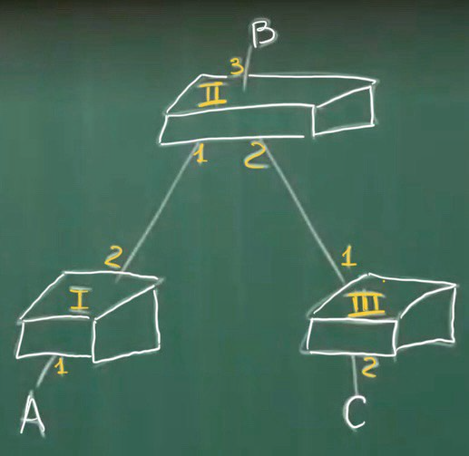
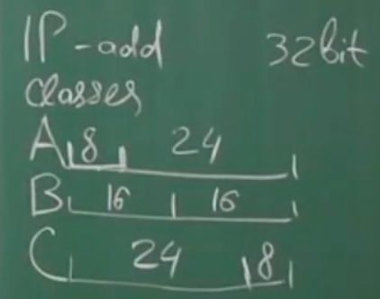
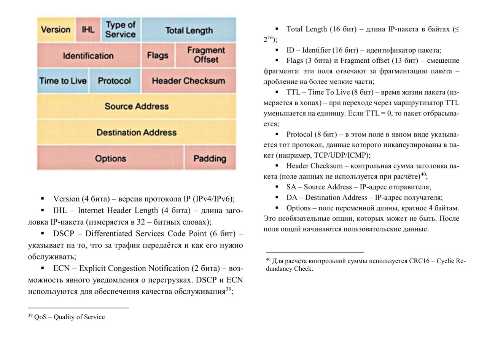

# Устройства канального уровня (продолжение)

## От моста к коммутатору: микросегментация сети

Мост, устройство, которое изучает MAC-адреса и отфильтровывает ненужный трафик, стал фундаментом для более совершенных устройств - коммутаторов (Switches).

## Коммутатор

Коммутатор представляет собой **многопортовый мост**, имеющий не два, а несколько портов. Каждый порт коммутатора может быть подключен к отдельному устройству сети.

### Микросегментация и полное дуплексное соединение

В результате использования коммутаторов произошла ```микросегментация``` сети. Каждый сегмент сети содержит только два устройства: коммутатор и подключенное к нему устройство (другой коммутатор или компьютер). 

Это приводит к полному дуплексному соединению (Full Duplex), где устройства могут передавать и получать данные одновременно, исключая возможность коллизий и повышая пропускную способность сети.

### Режимы работы коммутатора

Коммутаторы могут работать в разных режимах, оптимизируя процесс пересылки кадров и компромисс между производительностью и надежностью.

#### 1. Store and Forward (Сохраняет и перенаправляет)

Кадр сначала принимается и сохраняется, проверка контрольной суммы. Если кадр не битый - отправляем.

#### 2. Cut Through (Пропускной режим)

Основано на том, что ```у нас сеть нормальная и вероятность ошибки низкая```. 

Коммутатор получает часть кадра и анализирует DA, уже может быть принято решение о коммутации. Если кадр был битый, то он и передастся битым.

Когда исходящий интерфейс занят, может не начаться отправка. Появились буфера - для коммутатора стала не проблема разной скорости передачи.

#### 3. Fragment Free (Средний режим)

Принимаем первые 64 байта. Принимаем решение о коммутации. Считается, что коллизия может происходить только в первых 64 байтах.  

### Несколько коммутаторов 



Когда узел включается - отправляет широковещательный кадр. A - включился, коммутатор 1 обучился, дальше 2-ой коммутатор тоже обучился... И коммутатор не знает, реально ли устройство подключено к их порту. Это и не важно. Важно знать откуда видно это устройство.


# Сетевой уровень: IPv4

## Необходимость логических адресов

IP (Internet Protocol) - это основной протокол ```сетевого уровня``` в модели OSI. Он отвечает за маршрутизацию данных между различными сетями. 

MAC-адреса локальные (физические) адреса уникальны для каждого сетевого устройства, но они работают только в рамках одной локальной сети. Для создания глобальной сети необходимо использовать адреса, которые могут быть уникальными в масштабе всего Интернета. 

IP-адреса являются логическими адресами, которые присваиваются устройствам в сети. Эти адреса используются для маршрутизации данных между разными сетями. 

### Проблема с использованием только MAC-адресов:

Огромные таблицы маршрутизации: Если бы мы использовали только MAC-адреса для маршрутизации, то необходимо было бы создавать огромные таблицы с соответствием MAC-адреса и физического местоположения устройства в сети. Это было бы непрактично и неэффективно. 

## Структура

IP-адресация имеет **иерархическую структуру**, которая позволяет организовать сети и маршрутизацию данных в глобальном масштабе. 

IP-адрес состоит из 32 бит. Изначально маршрутизация была классовая ```ClassFull``` (Первые биты отвечают за класс: A, B или C). 



Сейчас безклассовая (```ClassLess```). Стали вводить подсети в хостовой части и ввели понятие маски. 

### Сетевая маска

Маска длиной 32 бита, такая же длина как IP-адреса, но имеет определенную структуру, сперва бинарные единицы, затем только бинарные нули:
```
11111.....111000....0
```

Тогда мы можем делить IP-адрес на сетевую и хостовую часть.

### Пример 

- 10.1.2.3
- 255.255.252.0

Перейдем в двоичную форму:

```
00001010.00000001.00000010.00000011
11111111.11111111.11111100.00000000
```

Тогда можем разделить на сетевую и хостовую части:
```
00001010.00000001.000000 | 10.00000011
11111111.11111111.111111 | 00.00000000
            net          |     host
```

### Зарезервированные адреса

* В хостовой части все нули - **Адрес сети**
* В хостовой части все единицы - **Широковещательный адрес подсети**

Если на хостовую часть выделено ```n бит``` => может быть ```2^n - 2``` узлов.


### Другой способ записи маски - CIDR (Classless Inter-Domain Routing)

Сколько в маске бинарных единиц, пишем через слэш: 10.1.2.3 / 29


## IP-Заголовок

Приведем заголовок в виде таблицы, где каждая строка символизирует 4 байтное слово (32 бита):



Тонкий момент, в заголовке два поля длины: 
* IHL - длина заголовка
* Length - длина заголовка и данных (длина пакета целиком)